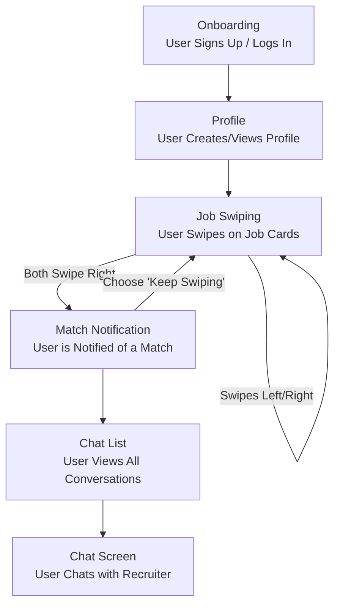

## Step 4: Validate Your Idea (Design Sprint)

To validate our "MatchWork" concept, we conducted a condensed, simulated Design Sprint. The primary goal was to create a low-fidelity prototype and a plan for testing it to ensure we are building a product that users want.

### 1. Map & Sketch: Defining the User Flow

We mapped out the critical path for a job seeker using the app. This flow represents the core experience we need to validate.

### 2. Prototype: AI-Generated UI Mockups

Instead of using a traditional design tool, we defined a series of detailed prompts to generate our UI prototype using an AI image generator. This represents a modern, rapid-prototyping approach.

**Key Screen Prompts:**

- **Image 1: Onboarding Screen:** A clean, welcoming screen with 'Sign Up' and 'Log In' options.
- **Image 2: Profile Screen:** A screen displaying the user's key professional information, including skills and experience.
- **Image 3: Job Swiping Screen:** The main interface featuring a swipeable job card with mandatory salary information.
- **Image 4: Match Notification Screen:** A celebratory screen appearing when both a candidate and a recruiter show mutual interest.
- **Image 5: Chat List Screen:** A list of all active conversations with potential employers.
- **Image 6: Chat Screen:** The interface for direct messaging between the candidate and the recruiter.

### 3. Test: User Feedback Plan

To test the prototype, we would present the AI-generated screens to potential users (e.g., fellow students, professionals in our target field) and ask targeted questions to gather feedback:

- Is the flow from sign-up to chat intuitive?
- How valuable is the mandatory salary range feature?
- Does the "mutual match" concept feel more rewarding than a traditional job application?
- Is there any information missing on the job card that you would expect to see?
- Would you be willing to use this app in your next job search?

This simulated sprint gives us confidence in the core user flow and highlights the key features to focus on during development.

### Grug Summary

big brain say "design sprint". grug say "make pictures, show people".

we make plan for pictures. sign up screen, profile screen, swipe screen, match screen, chat screen. simple flow. grug make prompts for AI to draw pictures for us. fast. cheap.

then we show pictures to other grugs. ask "you like?" "this make sense?" "salary number good?". if they say yes, we build. if they say no, we change pictures. no waste time building wrong thing. simple. smart.
