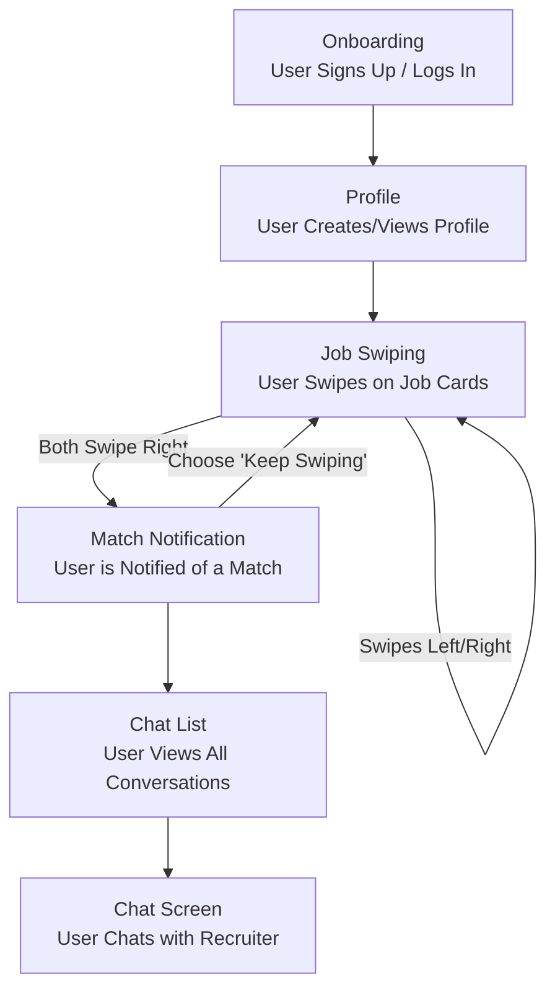

## Step 4: Validate Your Idea (Design Sprint)

To validate our "MatchWork" concept, we conducted a condensed, simulated Design Sprint. The primary goal was to create a low-fidelity prototype and a plan for testing it to ensure we are building a product that users want.

### 1. Map & Sketch: Defining the User Flow

We mapped out the critical path for a job seeker using the app. This flow represents the core experience we need to validate.

### 2. Prototype: AI-Generated UI Mockups

Instead of using a traditional design tool, we defined a series of detailed prompts to generate our UI prototype using an AI image generator. This represents a modern, rapid-prototyping approach. After an initial version, we refined the prompts to ensure maximum clarity and consistency.

**Final UI Prompts:**

- **Image 1: Onboarding Screen:** "Create a high-fidelity UI/UX mockup for the primary onboarding screen of 'MatchWork'. The design should be exceptionally clean and minimalist, using a deep navy blue (#191970) background, white text, and a vibrant coral (#FF6F61) accent for buttons. The screen must feature the logo, a headline ('Your Next Career Move Is a Swipe Away.'), and 'Create Account' / 'Log In' buttons."

- **Image 2: Profile Screen:** "Create a high-fidelity UI/UX mockup for a user's profile screen in 'MatchWork', maintaining the navy blue theme. The layout should be organized with cards for 'Summary', 'Experience', and 'Skills'. The skills should be displayed as pill-shaped tags in the coral accent color."

- **Image 3: Job Swiping Screen:** "Create a high-fidelity UI/UX mockup for the main job discovery screen of 'MatchWork', with a deep navy blue (#191970) background. The focus is a central, swipeable card with a light background, displaying the job title, company, location, and a prominent, can't-miss salary range."

- **Image 4: Match Notification Screen:** "Create a celebratory 'It's a Match!' modal overlay. The app background should be blurred. The modal should be joyful, featuring the user and company pictures, a connecting graphic, and a primary call-to-action button: 'Start a Conversation'."

- **Image 5: Messages Screen:** "Create a high-fidelity UI/UX mockup for the 'Messages' list screen, maintaining the navy blue (#191970) theme. The screen should feature a list of conversations on light-colored cards. Unread messages should be indicated with a small coral-colored dot."

- **Image 6: Chat Screen:** "Create a high-fidelity UI/UX mockup for an individual chat screen, consistent with the navy blue theme. Received messages should be in left-aligned gray bubbles, and sent messages should be in right-aligned coral-colored bubbles."

### 3. Test: User Feedback Plan

To test the prototype, we would present the AI-generated screens to potential users (e.g., fellow students, professionals in our target field) and ask targeted questions to gather feedback:

- Is the flow from sign-up to chat intuitive?
- How valuable is the mandatory salary range feature?
- Does the "mutual match" concept feel more rewarding than a traditional job application?
- Is there any information missing on the job card that you would expect to see?
- Would you be willing to use this app in your next job search?

This simulated sprint gives us confidence in the core user flow and highlights the key features to focus on during development.

### Grug Summary

big brain say "design sprint". grug say "make pictures, show people".

we make plan for pictures. sign up screen, profile screen, swipe screen, match screen, chat screen. simple flow. grug make prompts for AI to draw pictures for us. fast. cheap.

then we show pictures to other grugs. ask "you like?" "this make sense?" "salary number good?". if they say yes, we build. if they say no, we change pictures. no waste time building wrong thing. simple. smart.
