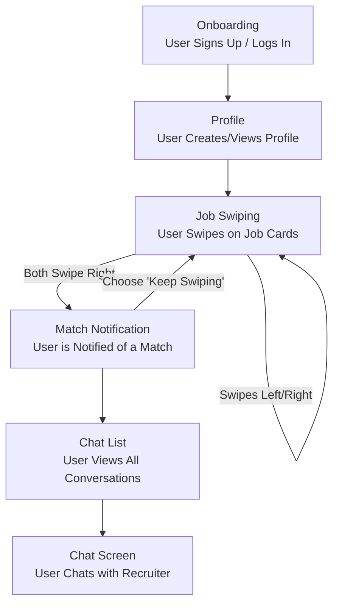

# M241 Project Documentation

## Step 1: Develop an Innovative Idea

After brainstorming several concepts, we have decided to pursue **"MatchWork"**, a modern career platform designed to streamline and improve the job-seeking process.

### The Core Concept

MatchWork is inspired by the "Tinder for Jobs" model. It is a mobile-first platform that facilitates a **mutual, double opt-in matching system** between job candidates and recruiters.

- **Candidates** create a detailed profile by uploading their CV, which is automatically parsed into skills, experience, and education. They can further enhance their profile with personal preferences and a bio.
- **Recruiters** post job listings with clear role descriptions and a **mandatory salary range** to ensure transparency.
- A **"Match"** occurs only when a candidate expresses interest in a job (swipes right) AND a recruiter expresses interest in that candidate. This match immediately opens a direct communication channel (chat) between both parties.

### Key Innovations

The project's innovation lies in directly addressing the primary frustrations of the traditional job market:

1.  **Eliminating the "Application Black Hole":** The mutual matching system ensures that candidates only connect with companies that are genuinely interested, ending the practice of sending applications into a void.
2.  **AI-Powered Intelligent Matching:** The platform will use an AI algorithm that goes beyond simple keyword matching. It learns from user behavior (both candidate and recruiter) to refine the feed of potential jobs and candidates, improving the quality and relevance of suggestions over time.
3.  **Enforced Transparency:** By making salary range a required field for all job postings, the platform saves time for both parties and fosters a more open and fair hiring environment.
4.  **Focus on Quality over Quantity:** MatchWork prioritizes creating a small number of high-quality, relevant connections over enabling mass, impersonal job applications.

### Grug Summary

grug think job hunt hard. send paper into black hole, hear nothing. bad.

"tinder for jobs" idea good. simple. you swipe right, company swipe right. then talk. no waste time. AI helps find good job, not just any job. company must say shiney rock range. grug like simple. this idea not complex. good.

---

## Step 2: Create a Business Model Canvas

We have created a Business Model Canvas to map out the structure of MatchWork, focusing on a zero-cost model suitable for a student project.

### Business Model Canvas: MatchWork (Student Project Edition)

1.  **Customer Segments:**

    - **Job Seekers:** Tech-savvy students and professionals (e.g., in IT, marketing, design) who value efficiency and transparency.
    - **Businesses/Recruiters:** Companies, especially startups and tech firms, looking for efficient ways to find talent.

2.  **Value Propositions:**

    - **For Job Seekers:** A fast, transparent, and engaging way to find relevant job opportunities without the frustration of the "application black hole."
    - **For Businesses:** Access to a curated pool of interested candidates via an AI-powered matching system, reducing hiring time.

3.  **Channels:**

    - **Mobile App:** The primary channel (iOS/Android), developed with a cross-platform framework.
    - **Web Platform:** A responsive web app deployed for free on platforms like Vercel.
    - **Organic Marketing:** Social media (LinkedIn, etc.), word-of-mouth, and content marketing.

4.  **Customer Relationships:**

    - **Automated & Self-Service:** The platform is designed to be entirely self-service.
    - **Community & Support:** A simple FAQ page and a link to a GitHub repository for feedback.

5.  **Revenue Streams (Hypothetical):**

    - For this academic exercise, the platform operates at zero cost and generates no revenue. A hypothetical model would be **Freemium for Recruiters**, while always remaining **100% free for Job Seekers.**

6.  **Key Activities:**

    - **Platform Development & Maintenance:** Building and improving the app, website, and the core AI matching algorithm.
    - **Community Building:** Encouraging adoption through organic channels.
    - **Data Security:** Ensuring user data is handled securely.

7.  **Key Resources:**

    - **The Platform/Codebase:** The core intellectual property being built.
    - **Development Team:** Our project group.
    - **Free-Tier Cloud Infrastructure:** Using services with generous free tiers like **Vercel** (frontend), **Render** (backend), and **Supabase/Firebase** (database/auth).

8.  **Key Partnerships:**

    - **University Career Services:** Partnering with universities to onboard students.
    - **Tech Communities:** Engaging with online developer communities to attract early adopters.

9.  **Cost Structure:**
    - As a student project, all real-world costs are **$0**.
    - **Personnel Costs:** $0 (Effort from the project team).
    - **Infrastructure Costs:** $0 (Strictly using free tiers of services).
    - **Marketing & Sales Costs:** $0 (Focusing on organic growth).

### Grug Summary

grug see many boxes. big brain stuff. but ok. it say who use, who pay. job seeker use free, good. company pay for more, get more shiney rock. need server, but use free server like vercel. no pay, no problem. keep simple. canvas say plan is simple. grug happy.

---

## Step 3: Choose a Business Model Pattern

We have selected the **"Freemium"** pattern from the St. Gallen Business Model Navigator as the most suitable model for MatchWork.

### 1. What is the Freemium Pattern?

The Freemium pattern involves offering a basic version of a product or service for free, while charging for a premium version with advanced features, functionality, or benefits. The free offering attracts a large user base, which can then be converted to paying customers for the premium services.

### 2. Why does this pattern fit MatchWork?

- **Reduces Barrier to Entry:** To solve the "chicken-and-egg" problem in a two-sided market (where you need job seekers to attract recruiters, and vice-versa), the free offering is crucial. It allows both sides to join and see value without any initial financial commitment.
- **Value-Based Upsell:** The model aligns perfectly with our customer segments. The free tier offers enough value for a small company, but larger companies with greater hiring needs will require the features of a premium subscription. The revenue model is tied directly to the value a business derives from the platform.
- **Free for Job Seekers:** It aligns with our core principle that the platform must always be free for the individual. The cost is placed on the side with commercial intent (the hiring company).

### 3. How is it implemented in MatchWork?

- **Free Version:** All Job Seekers get full access for free. Recruiters can post a limited number of jobs and access basic matching features for free.
- **Premium Version (Hypothetical):** For a subscription fee, recruiters would unlock features like unlimited job postings, advanced candidate filters, company branding, and an analytics dashboard.

### Grug Summary

"freemium" is big brain word for simple idea. give thing for free, people come. if they like and want more, they pay shiney rock. recruiter get basic for free. if they want more power, they pay. job seeker always free. this fair. this simple. this good plan.

---

## Step 4: Validate Your Idea (Design Sprint)

To validate our "MatchWork" concept, we conducted a condensed, simulated Design Sprint. The primary goal was to create a low-fidelity prototype and a plan for testing it to ensure we are building a product that users want.

### 1. Map & Sketch: Defining the User Flow

We mapped out the critical path for a job seeker using the app. This flow represents the core experience we need to validate.

### 2. Prototype: AI-Generated UI Mockups

Instead of using a traditional design tool, we defined a series of detailed prompts to generate our UI prototype using an AI image generator. This represents a modern, rapid-prototyping approach. After an initial version, we refined the prompts to ensure maximum clarity and consistency.

**Final UI Prompts:**

- **Image 1: Onboarding Screen:** "Create a high-fidelity UI/UX mockup for the primary onboarding screen of 'MatchWork'. The design should be exceptionally clean and minimalist, using a deep navy blue (#191970) background, white text, and a vibrant coral (#FF6F61) accent for buttons. The screen must feature the logo, a headline ('Your Next Career Move Is a Swipe Away.'), and 'Create Account' / 'Log In' buttons."

- **Image 2: Profile Screen:** "Create a high-fidelity UI/UX mockup for a user's profile screen in 'MatchWork', maintaining the navy blue theme. The layout should be organized with cards for 'Summary', 'Experience', and 'Skills'. The skills should be displayed as pill-shaped tags in the coral accent color."

- **Image 3: Job Swiping Screen:** "Create a high-fidelity UI/UX mockup for the main job discovery screen of 'MatchWork', with a deep navy blue (#191970) background. The focus is a central, swipeable card with a light background, displaying the job title, company, location, and a prominent, can't-miss salary range."

- **Image 4: Match Notification Screen:** "Create a celebratory 'It's a Match!' modal overlay. The app background should be blurred. The modal should be joyful, featuring the user and company pictures, a connecting graphic, and a primary call-to-action button: 'Start a Conversation'."

- **Image 5: Messages Screen:** "Create a high-fidelity UI/UX mockup for the 'Messages' list screen, maintaining the navy blue (#191970) theme. The screen should feature a list of conversations on light-colored cards. Unread messages should be indicated with a small coral-colored dot."

- **Image 6: Chat Screen:** "Create a high-fidelity UI/UX mockup for an individual chat screen, consistent with the navy blue theme. Received messages should be in left-aligned gray bubbles, and sent messages should be in right-aligned coral-colored bubbles."

### 3. Test: User Feedback Plan

To test the prototype, we would present the AI-generated screens to potential users (e.g., fellow students, professionals in our target field) and ask targeted questions to gather feedback:

- Is the flow from sign-up to chat intuitive?
- How valuable is the mandatory salary range feature?
- Does the "mutual match" concept feel more rewarding than a traditional job application?
- Is there any information missing on the job card that you would expect to see?
- Would you be willing to use this app in your next job search?

This simulated sprint gives us confidence in the core user flow and highlights the key features to focus on during development.

### Grug Summary

big brain say "design sprint". grug say "make pictures, show people".

we make plan for pictures. sign up screen, profile screen, swipe screen, match screen, chat screen. simple flow. grug make prompts for AI to draw pictures for us. fast. cheap.

then we show pictures to other grugs. ask "you like?" "this make sense?" "salary number good?". if they say yes, we build. if they say no, we change pictures. no waste time building wrong thing. simple. smart.

---

## Step 5: Choose an Innovative Framework

For the development of the "MatchWork" prototype, we have selected **NEXT.js** as our primary technology framework.

### 1. What is NEXT.js?

NEXT.js is a popular, open-source React framework for building full-stack web applications. It provides a robust structure for creating both the user interface (frontend) and the server-side logic (backend) in a single, cohesive project.

### 2. Why is NEXT.js the best fit for MatchWork?

- **Full-Stack Capability:** MatchWork is a dynamic application that requires a database, user authentication, and a real-time messaging API. NEXT.js allows us to build these backend features as API Routes directly within our project, which simplifies development and deployment immensely.
- **Performance and User Experience:** It enables various rendering strategies (Server-Side Rendering, Static Site Generation) that allow us to optimize the performance of different parts of our app, ensuring a fast and smooth experience for the user.
- **Easy Deployment:** It is designed for seamless, zero-configuration deployment on platforms like **Vercel**, which aligns perfectly with our Business Model Canvas decision to use free-tier hosting solutions.
- **Rich Ecosystem:** As it's built on React, we gain access to the vast ecosystem of libraries and tools available for React, accelerating development for features like the card swipe mechanic or the chat interface.

### 3. Comparison with Other Options

- **Gatsby:** Is more specialized for static, content-heavy websites and is less suitable for a highly interactive application like MatchWork.
- **Remix:** While a powerful alternative, NEXT.js has a larger community and more extensive documentation, making it a more reliable choice for this project.
- **Blitz/Redwood:** These are more opinionated frameworks. NEXT.js offers greater flexibility, which is beneficial for a project that might evolve.

### Grug Summary

need choose tool to build app. many tool. much confusion.

we choose NEXT.js. why? it let us build pretty front part and smart back part in same place. less mess. it work good with Vercel, the free server place. it fast. many other grugs use it, so easy find help if get stuck.

other tools ok, but NEXT.js is good, strong club for this job. not too simple, not too complex. just right.

---

## Step 6: Evaluate Your Innovation

To evaluate the innovative aspects of "MatchWork" and understand its position in the broader market, we have chosen to conduct a **PESTEL Analysis**.

### PESTEL Analysis for MatchWork

PESTEL is an acronym for **P**olitical, **E**conomic, **S**ocial, **T**echnological, **E**nvironmental, and **L**egal factors.

- **Political:** Government employment initiatives and, most importantly, data privacy regulations (like GDPR) are key political factors that shape the app's development and data handling requirements.

- **Economic:** The platform's value proposition is strong in any economy. In a good economy, it helps recruiters find scarce talent. In a bad economy, it helps job seekers stand out. The rise of the remote work economy is a major tailwind for the project.

- **Social:** The app directly caters to modern social trends, such as the demand for transparency (mandatory salary) and flexibility (remote work). Its mobile-first, swipe-based interface aligns with the digital habits of younger generations.

- **Technological:** Our core innovation is technological. We leverage **AI** for smarter matching and rely on modern **Cloud Computing** platforms (Vercel, etc.) to make the project feasible at zero cost.

- **Environmental:** By being a fully digital platform and facilitating remote work, MatchWork offers minor but positive environmental benefits by reducing paper waste and commuting.

- **Legal:** The platform is built around the growing legal trend of **salary transparency laws**. By making this a mandatory feature, we are not only ethically aligned but also legally prepared for future regulations. We must also ensure our matching algorithm is designed to comply with Equal Opportunity Employment laws.

### Grug Summary

big world outside our app. PESTEL help us look at it.

world have rules (Political, Legal). world have money situation (Economic). world have people trends (Social). world have new tools (Technological).

our app, MatchWork, fits good in big world. it follow new laws about salary. it work good if economy good or bad. people want easy, phone-first job hunt. we use new AI tool. this is good plan. we not fighting the world, we work with it.
